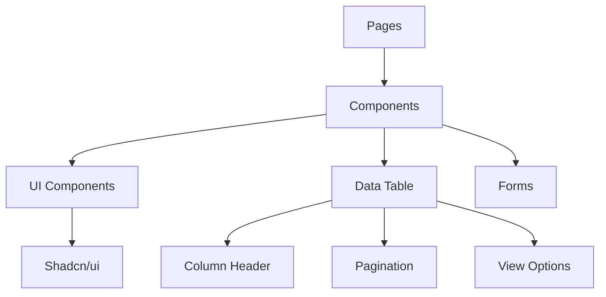
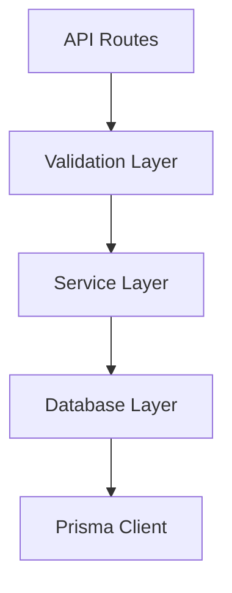

# System Patterns

## Arsitektur Sistem

### 1. Frontend Architecture


### 2. API Architecture


## Design Patterns

### 1. Component Patterns
- Atomic Design
  - Atoms (basic UI components)
  - Molecules (composite components)
  - Organisms (complex components)
  - Templates (page layouts)
  - Pages (full views)

### 2. Data Management
- Repository Pattern
  - Abstraksi database operations
  - Service layer untuk business logic
  - Controllers untuk request handling

### 3. State Management
- Server State
  - Database queries
  - Cached responses
- Client State
  - UI state
  - Form state
  - Table state (sorting/filtering)

## Implementasi Patterns

### 1. DataTable Pattern
```typescript
interface DataTableProps<TData, TValue> {
    columns: ColumnDef<TData, TValue>[]
    data: TData[]
}

// Components:
- DataTableColumnHeader
- DataTablePagination
- DataTableViewOptions
```

### 2. API Pattern
```typescript
// Validation Schema
const Schema = z.object({
    phone: z.string()
        .min(1, "Required")
        .regex(/^62\d+$/, "Must start with 62")
})

// Service Layer
async function handleRequest(data) {
    // 1. Validate
    // 2. Process
    // 3. Respond
}
```

### 3. Error Handling Pattern
```typescript
try {
    // Operation
} catch (error) {
    // Log error
    // Return safe response
}
```

## Caching Strategy
1. Server-side
   - Dynamic routes with revalidation
   - No-store for real-time data
   
2. Client-side
   - State management
   - UI caching

## Security Patterns
1. Input Validation
   - Zod schemas
   - Type checking
   - Format validation

2. API Security
   - Request validation
   - Error handling
   - Safe responses

## Testing Patterns
1. Unit Tests
   - Component testing
   - Function testing
   - Validation testing

2. Integration Tests
   - API endpoints
   - Data flow
   - User flows 